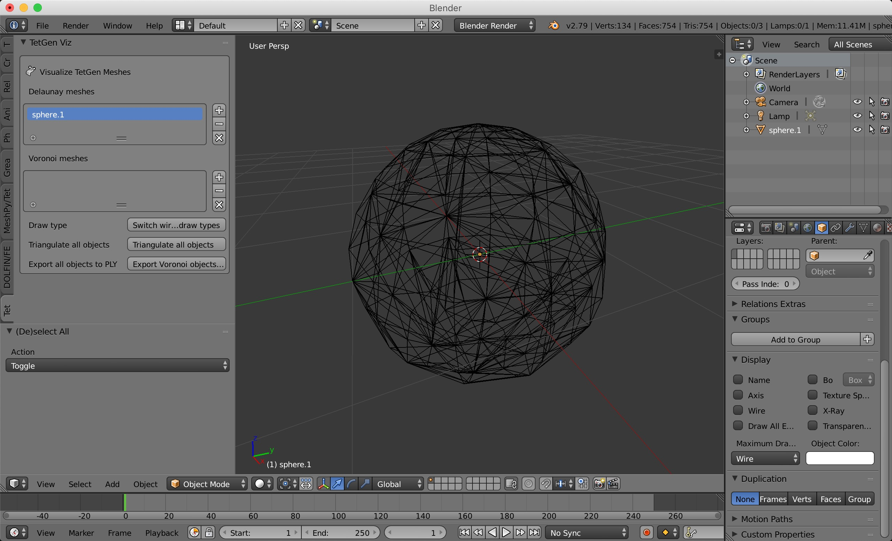
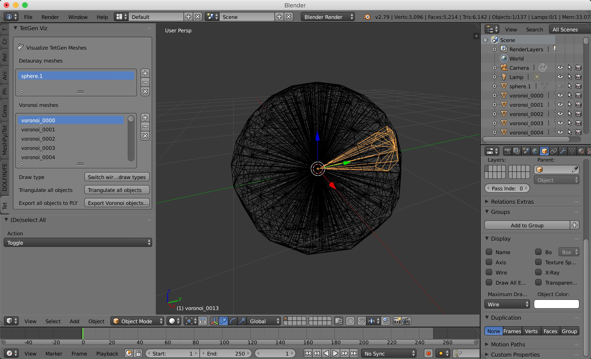
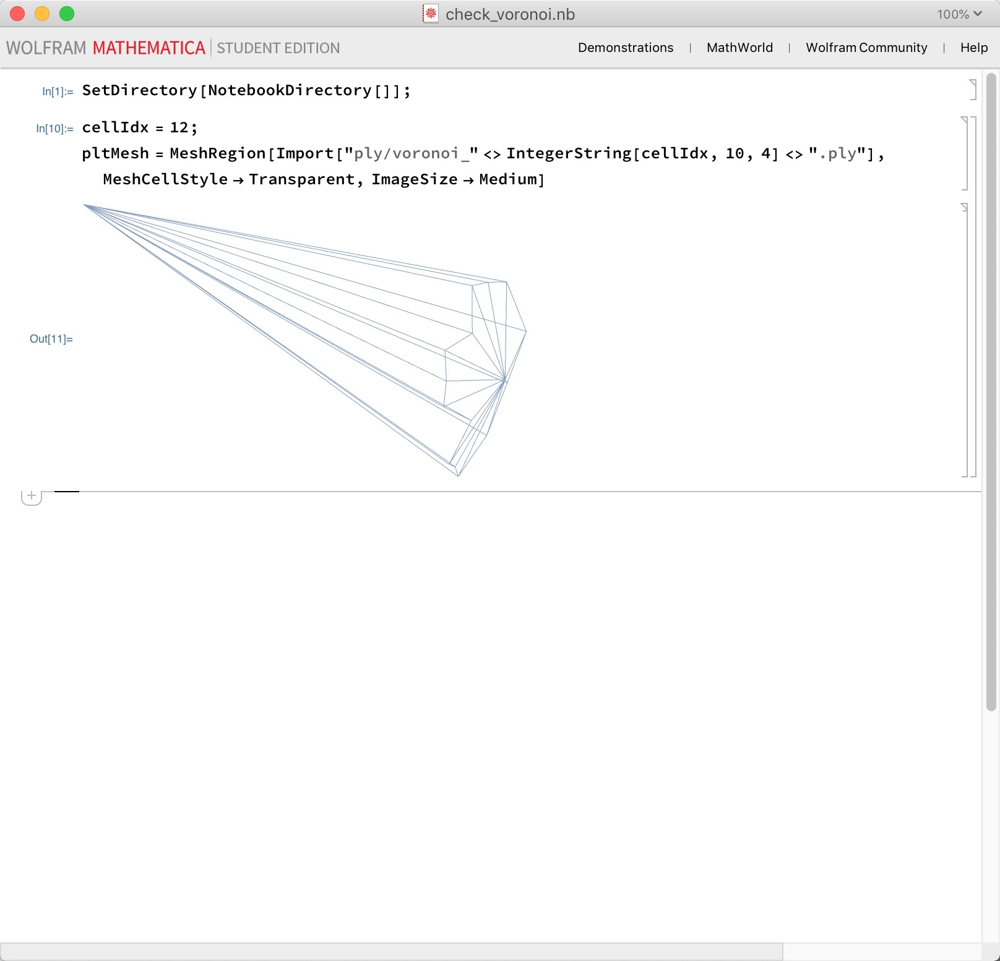

# Visualize TetGen Delaunay and Voronoi Meshes in Blender

**Unofficial! At your own risk.**

See [TetGen](http://wias-berlin.de/software/tetgen/).

This add-on can be used to visualize the Delaunay and Voronoi meshes produced by TetGen. It is designed with constrained Delaunay in mind (i.e. provide an input surface mesh to TetGen) - possibly it will also work for point clouds.

## Installation

The usual installation for Blender add-ons. Probably the easiest is:
1. Archive the `tetgen_viz` directory to create a `.zip`.
2. Navigate to the add-ons panel in the preferences in Blender.
3. Click `Install Add-on from File` and select the `.zip`.
4. Make sure to check the checkmark box, and `Save User Settings` at the bottom so you don't have to reinstall again later.

## Compatability with TetGen versions

Supports in principle all versions of TetGen; only the output is needed. File formats are described [here](http://wias-berlin.de/software/tetgen/1.5/doc/manual/manual006.html).

## Flags to pass to TetGen

The following are recommended: `-n -f -e`. See below for description. The flags are described [here](https://wias-berlin.de/software/tetgen/switches.html).

## Description

For visualizing **Delaunay meshes**, the following 4 output files are needed:
* `sphere.node`
* `sphere.edge`
* `sphere.face`
* `sphere.node`
These should be generated automatically; make sure you pass the `-f` and `-e` flags to get all the faces and edges (not just on the boundary).

For visualizing **Voronoi meshes**: TetGen has a flag `-v`, but as of version `1.5.1` this only works when you pass in point clouds as the input. If you pass an existing surface mesh, the following bugs will occur (not thoroughly tested):
* In `1.5.1`: the `.cell` files are incorrect.
* In `1.5.0`: no output is generated.
* In `1.4.?`: output that looks OK at first but does not produce the correct Voronoi diagram.

Instead, this add-on **recalculates** the dual mesh from the Delaunay. To do this, it uses (because it is convenient) the neighbor file of neighboring tets:
* `sphere.neigh`
which is generated by the `-n` flag.

## Example usage

The example files are in the `example` directory.

1. Fire up TetGen on the `sphere.ply` surface mesh provided:
```
tetgen -f -e -n sphere.ply
```
This generates `.node`, `.ele`, `.face`, `.edge`, `.smesh`, and `.neigh` files.

2. Open Blender and open the `TetGen viz` panel on the left.

3. Import the Delaunay mesh: click the `+` symbol next to the Delaunay mesh list and select the following four files: `.node`, `.edge`, `.face`, and `.ele`, which describe the nodes, edges, faces, and elements of the Delaunay mesh. The object will appear in the list under Delaunay meshes. The output should look like this:



Note: you may have to change the draw type from `Textured` to `Wire` (bottom left panel).

4. Import the Voronoi mesh: click the `+` symbol next to the Voronoi mesh list and select the `.neigh` file, which describes the neighboring elements in the Delaunay mesh. Make sure that the correct object is also selected in the Delaunay mesh list. The Voronoi dual is computed from these inputs. The output should look like this:



Note: click the `Switch wire and textured draw types` button to make all the Voronoi cells appear as wires/textured.

Note: we make a choice here for the cells on the boundary. Technically the Voronoi elements extend into infinity beyond the boundary of the original mesh; here we terminate them at the boundary. We simplify the faces of the Voronoi elements on the boundary by using bisections of the original triangular surface mesh - **this is not quite correct! If you need this to be correct, this requires some further programming to calculate the correct intersections of the Voronoi boundary planes with the original surface mesh.**

5. (Optional): Triangulate the faces of the Voronoi cells by clicking the `Triangulate all objects` button.

6. Export all the objects to `.ply` files by clicking the `Export Voronoi objects to PLY` button.

7. (Optional) use the provided Mathematica notebook `check_voronoi.nb` to visualize and validate the `.ply` files.


