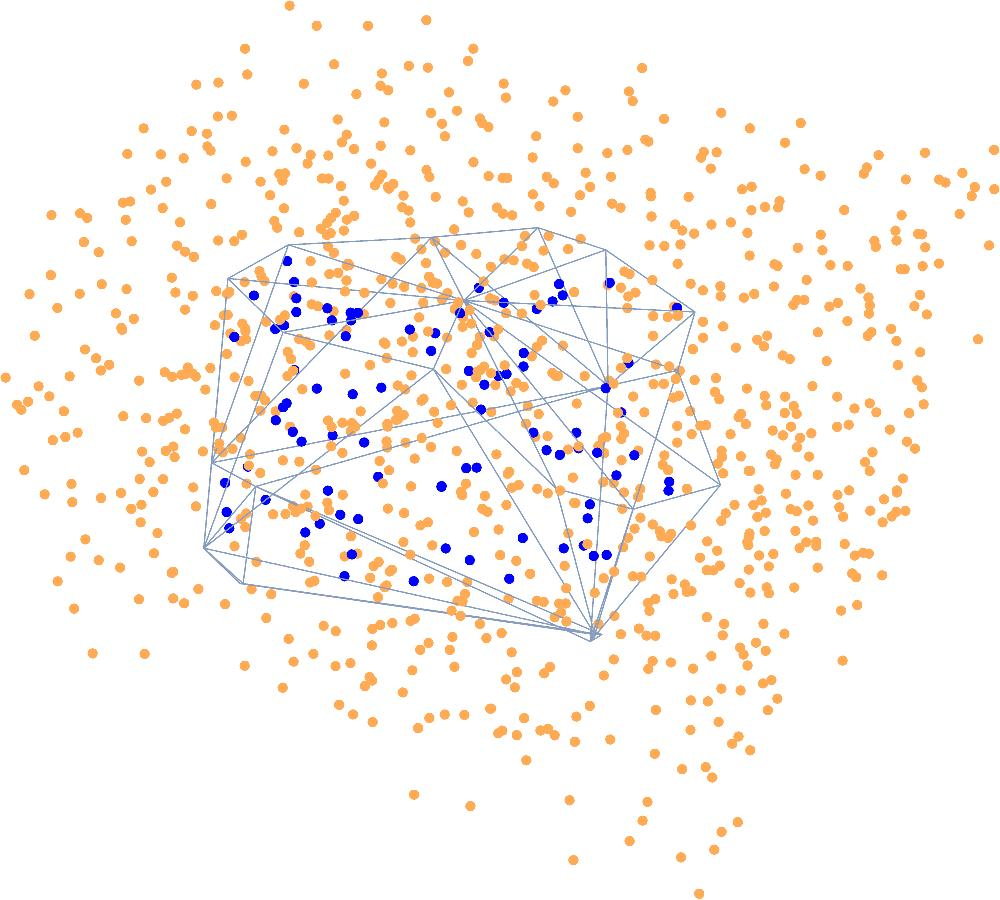
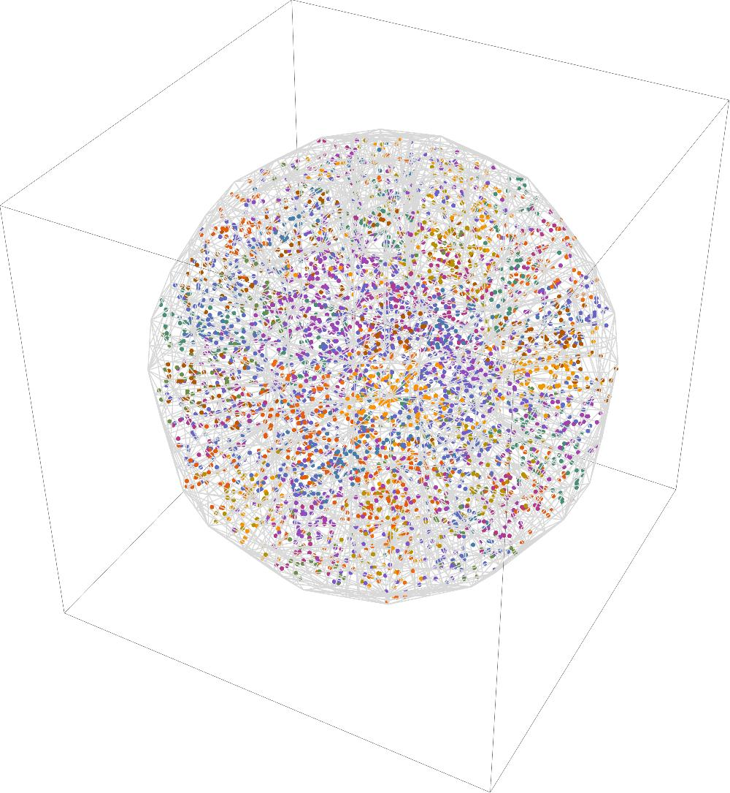

# Test which points fall inside/outside using TetMesh

* `voronoi_mesh` contains two classes `VoronoiElement` and `VoronoiMesh` (a mesh is composed of multiple elements).
* `test_element.py` generates random points for a chosen Voronoi cell and tests which points fall inside/outside. This can be visualized with the Mathematica notebook `test_element.nb`.
* `test_mesh.py` generates random points for a mesh and assigns them to different cells. This can be visualized with the notebook `test_mesh.nb`.

